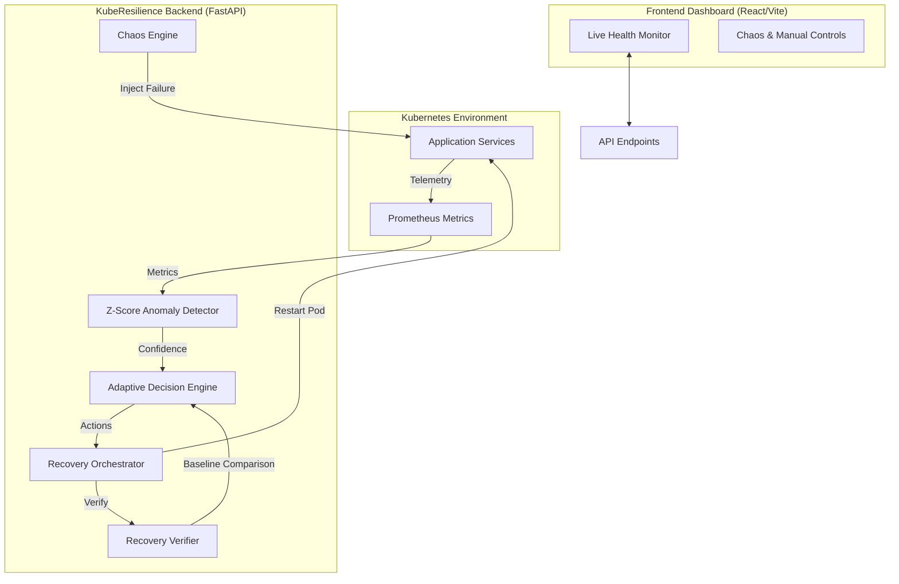

# 🛡️ KubeResilience

### **MIT-BLR Hackathon 2026 Submission**
A proactive, automated chaos engineering and self-healing platform for Kubernetes clusters.

---

## 👥 Team: The Resilience Squad
- **Nitin**
- **Arsh**
- **Tanju**
- **Dhruv**

---

## 🚀 Overview

**KubeResilience** is a sophisticated monitoring and recovery orchestration layer designed to ensure high availability for microservices. It bridges the gap between chaotic failure injection and automated, data-driven recovery. By leveraging Real-time Anomaly Detection (Z-Score based) and an Adaptive Decision Engine, the system identifies service degradations and executes precise recovery actions like pod restarts and circuit breaking.

### 🌟 Key Features
- **Proactive Anomaly Detection**: Uses a Z-Score based detector to identify deviations in p95 latency, error rates, and resource utilization.
- **Adaptive Decision Engine**: Implements severity scoring, blast radius guarding, and dynamic cooldowns to prevent recovery loops.
- **Automated Chaos Orchestration**: Integrated chaos engine capable of injecting latency, error rates, and resource exhaustion **safely**.
- **Circuit Breaker Integration**: Automatically intercepts traffic to failing services during recovery to prevent cascading failures and data loss.
- **Live Dashboard**: A real-time React-based observability dashboard for monitoring service health and incident history.

---

## 🏗️ Architecture



---

## 🛠️ Tech Stack

### **Backend**
- **Framework**: FastAPI (Python 3.11+)
- **Database**: SQLAlchemy (SQLite for demo simplicity)
- **Monitoring**: Prometheus Integration (Client-side metrics fetching)
- **ML/Analytics**: Scikit-Learn (Z-Score & Baseline Statistics)
- **Chaos Engine**: Custom Kubernetes Python Client Integration

### **Frontend**
- **Framework**: React 19 (Vite)
- **Visuals**: Recharts (Live telemetry visualization)
- **Styling**: Vanilla CSS with Modern Aesthetics

---

## 🚦 Getting Started

### Prerequisites
- Python 3.11+
- Node.js 18+
- Access to a Kubernetes Cluster (or `minikube`/`kind`)
- Prometheus installed in the cluster (configurable via `config.py`)

### 📦 Installation

#### 1. Clone the Repository
```bash
git clone https://github.com/dptel22/MIT-HACKATHON.git
cd MIT-HACKATHON
```

#### 2. Backend Setup
```bash
cd backend
python -m venv .venv
source .venv/bin/activate  # On Windows: .venv\Scripts\activate
pip install -r requirements.txt
uvicorn main:app --reload --port 8000
```

#### 3. Frontend Setup
```bash
cd frontend
npm install
npm run dev
```

---

## 🎮 Usage Guide

1. **Warmup Phase**: The system initializes by loading pre-trained baseline statistics for tracked services.
2. **Chaos Injection**: Use the dashboard to manually inject chaos (Latency, CPU spikes) or enable **Auto-Chaos Mode** for automated stresstesting.
3. **Detection & Decision**: The backend polls Prometheus metrics. If an anomaly is detected with high confidence, the Decision Engine evaluates if a recovery is safe to proceed.
4. **Recovery**: The platform automatically restarts affected pods and enters a "Circuit Breaker" state to protect the service during the cooldown period.

---

## 📄 License
This project is prepared specifically for the **MIT-BLR Hackathon 2026**.
